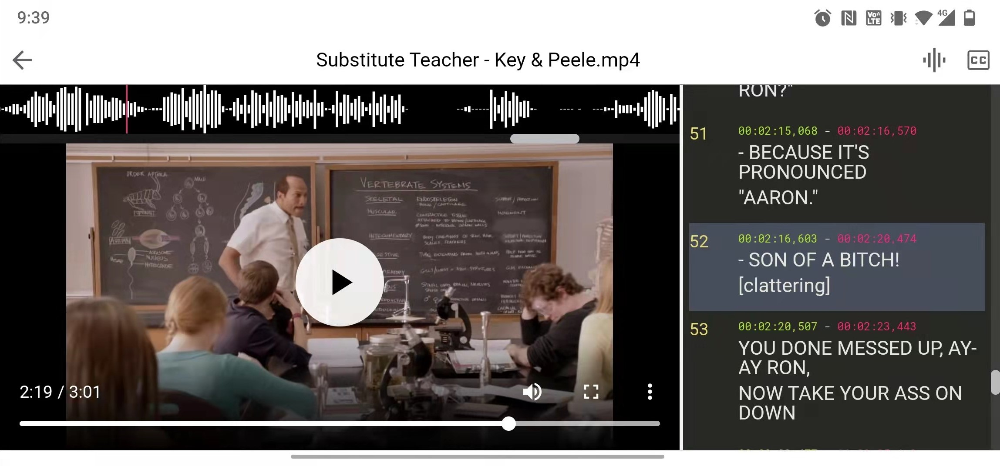

  

# SRT Player

[中文介绍](https://zhuanlan.zhihu.com/p/469289749)

Video player with separate subtitle display and waveform 

[Try it here](https://shenmin-z.github.io/srt-player/)

Screenshot on android Chrome

Video demo: [youtube](https://youtu.be/UpgwD5ejwMo), [哔哩哔哩](https://www.bilibili.com/video/BV1Ci4y1d7iA/)

## Features

### Subtitle

- adjust delay in a breeze (`click` on start or end time that is above individual subtitle text)

### Waveform

- find the exact location to replay (`click` to set replay position)

### Offline usable

- onced loaded, can be used without internet next time

## About importing videos

To persist imported videos:

- use desktop Chrome or Edge, which supports reading local files(user permission required)
- check the `Copy file(s) to cache` option when importing, which will make a copy of video file to browser storage

## Limitations

- video has to be in codecs that browser supports
- mordern browser is recommended
