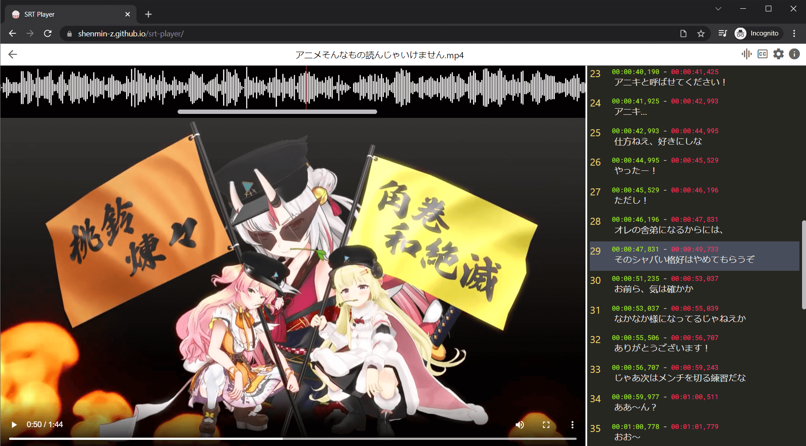

# SRT Player - Learn foreign languages by watching videos!

[https://shenmin-z.github.io/srt-player/](https://shenmin-z.github.io/srt-player/)



Video demo: [youtube](https://youtu.be/UpgwD5ejwMo)

### What's wrong with normal video player?

- Normal video players only show subtitle for the current moment, and subtitle text is normally not selectable
- Sometimes video and subtitle's timeline don't match, and it's not easy to adjust
- When practicing listening, you want to replay ONLY the exact part that you didn't get

## Features

### Subtitle

- scrollable and selectable (so you can copy & paste into dictionary)
- auto mode (automatically scrolls as video plays)
- adjust delay easily (`right click` on the subtitle that should be displayed, and delay will be automatically set)
- manual mode (scroll it yourself)

### Waveform

- find the exact location to replay (`click` to set replay position, which is indicated by a vertical yellow line, and press `r` to play at that position)

### Offline usable

- onced loaded, can be used without internet next time

## Limitations

- Desktop Chrome only (needs [showOpenFilePicker](https://caniuse.com/?search=showOpenFilePicker) to read local files)
- Video has to be in codecs that browser can play, which means if your video file has an incompatible format you will have to convert it to a compatible one first
- Waveform generation might not be accurate or fail on large file, in which case you can extract audio from video with some other software and select the `Enable using extra audio file` option

## Recommended tools to use in combination

- [Yomichan](https://foosoft.net/projects/yomichan/) (Japanese dictionary)
- ffmpeg

```bash
# change codecs
ffmpeg -i input.mkv -c:v h264 -c:a aac output.mp4
# extract audio
ffmpeg -i input.avi -vn output-audio.mp3
```
